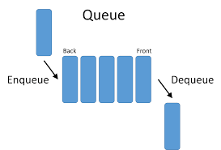

# queue - data structure

## definition
> Queue is an abstract data structure, somewhat similar to Stacks.
> Unlike stacks, a queue is open at both its ends.
> One end is always used to insert data (enqueue) and the other is used to remove data (dequeue).
> Queue follows First-In-First-Out methodology, i.e., the data item stored first will be accessed first.

## general methods


### enqueue
to add an element to the queue.


### dequeue
to return the head element of a queue and delete it.

### getHeadElement
to get the head element of a queue without deleting it.

## Java code examples
_**enqueue**_
``` java
if(elements.size() != maxSize)
elements.add(object);
```

_**dequeue**_
``` java
if(elements.size() > 0)
object = elements.get(0);
elements.remove(0);
return object;
```

## Links
> [Queue documentation](https://www.geeksforgeeks.org/queue-data-structure/)